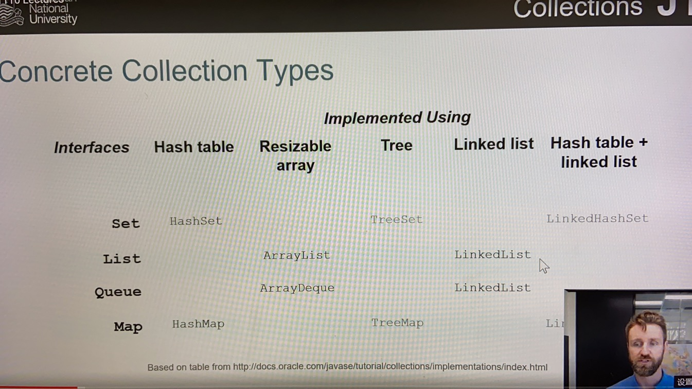

<t>**The Collection Framework**</t>

Including interface, implementations,algorithms

<ol>Interface
<li> Basic operators: size, isEmpty(), contains(), add(), remove()</li>
<li> Traversal: for-each, iterators
<li>Bulk operators(批量操作符): containsAll(), addAll(), removeAll, retainAll(), clearAll()</li>
<li>Array operators: convert to and from arrays </li></ol>

<ol>Collection Type
<li>Primary collection types:<ul>Set(no duplicates)</ul>
<ul>List(ordered elements)</ul>
<ul>Queue(shared work queues)</ul>
<ul>Map("Key, Value"pairs)</ul>
</li>
<li>Each collection type is defined as an interface</li>
</ol>

<ol>Commonly use Collection
<li>HashSet:no ordering guarantees</li>
<li>ArrayList: list, very access</li>
<li>HashMap: no ordering guarantees map by hashtable</li>
<li>LinkedList: a queue, FIFO</li>
</ol>

<ol>For each: for(Thing t:things){System.out.printLn(t)} instead of things.forEach(t->System.out.printLn(t))</ol>
Collection.sort(), Lambda (a T, b T) -> {return 《expression》}</ol>

<ol>Josh Bloch "Prefer lists to arrays"
<ul>Arrays are covariant, Generics are invariant</ul>
if A extends B, then A [] is a subclass of B[], but ListA has no relationship to ListB.
  List can be more safe
</ol>